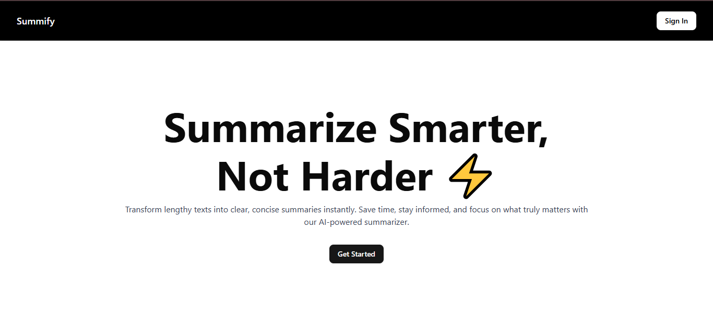
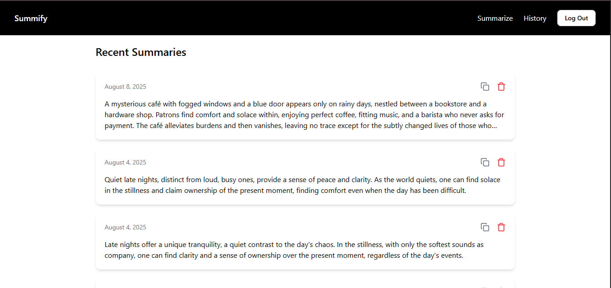

# Summify — AI-Powered Text Summarizer ⚡

**Summify** is a full-stack web application that uses **Google’s Gemini AI** to turn long-form text into concise, meaningful summaries. Designed with productivity and simplicity in mind, it helps users quickly digest large content, while storing summaries securely and efficiently.

🔗 **Live Demo:** [summify-chi.vercel.app](https://summify-chi.vercel.app)  

---

## 🚀 Key Features

- 🔐 **Authentication with Firebase** (Google Sign-In)
- ✍️ **AI-Powered Summarization** using Gemini Pro via API
- 🧠 **User-Specific History:** Save and retrieve summaries per authenticated user
- 📋 **Copy to Clipboard** functionality for quick use
- 🗑️ **Delete Summaries** with instant feedback
- 📱 **Mobile-Responsive Design** with clean, user-friendly UI

---

## 🛠️ Tech Stack

- **Frontend**: Next.js 15, TypeScript, Tailwind CSS
- **Backend**: Firebase Firestore
- **Authentication**: Firebase Auth (Google OAuth)
- **AI Integration**: Google Gemini API
- **Deployment**: Vercel

---

## 📸 Screenshots  







---

### Environment variables

```
NEXT_PUBLIC_FIREBASE_API_KEY=your_api_key
NEXT_PUBLIC_FIREBASE_AUTH_DOMAIN=your_auth_domain
NEXT_PUBLIC_FIREBASE_PROJECT_ID=your_project_id
NEXT_PUBLIC_FIREBASE_STORAGE_BUCKET=your_storage_bucket
NEXT_PUBLIC_FIREBASE_MESSAGING_SENDER_ID=your_sender_id
NEXT_PUBLIC_FIREBASE_APP_ID=your_app_id
NEXT_PUBLIC_GEMINI_API_KEY=your_gemini_key
```

---

## 💼 About the Project

This project was built to showcase:
- Real-world use of modern tools like Firebase and AI APIs
- Frontend expertise with responsive, user-centric design
- Secure handling of user data and integration of third-party APIs
- A complete developer experience from ideation to deployment